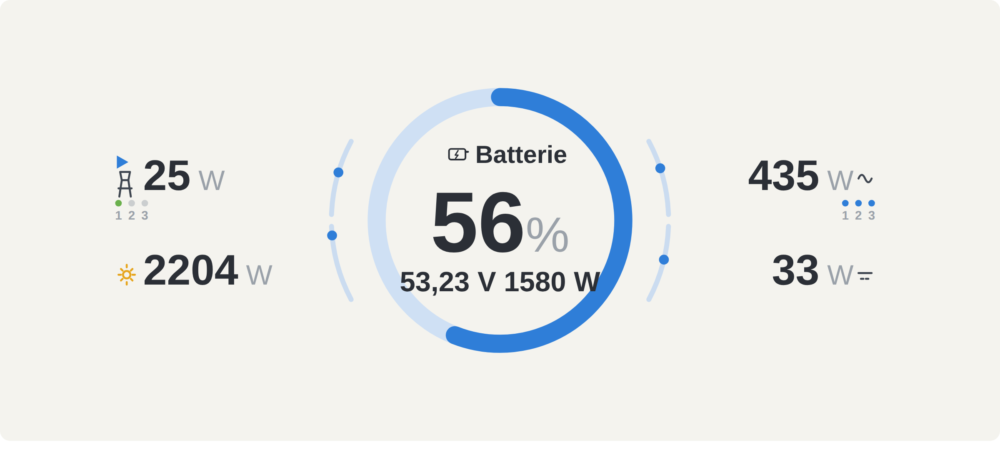
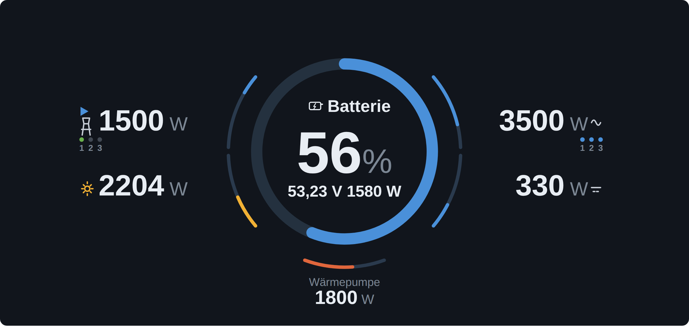
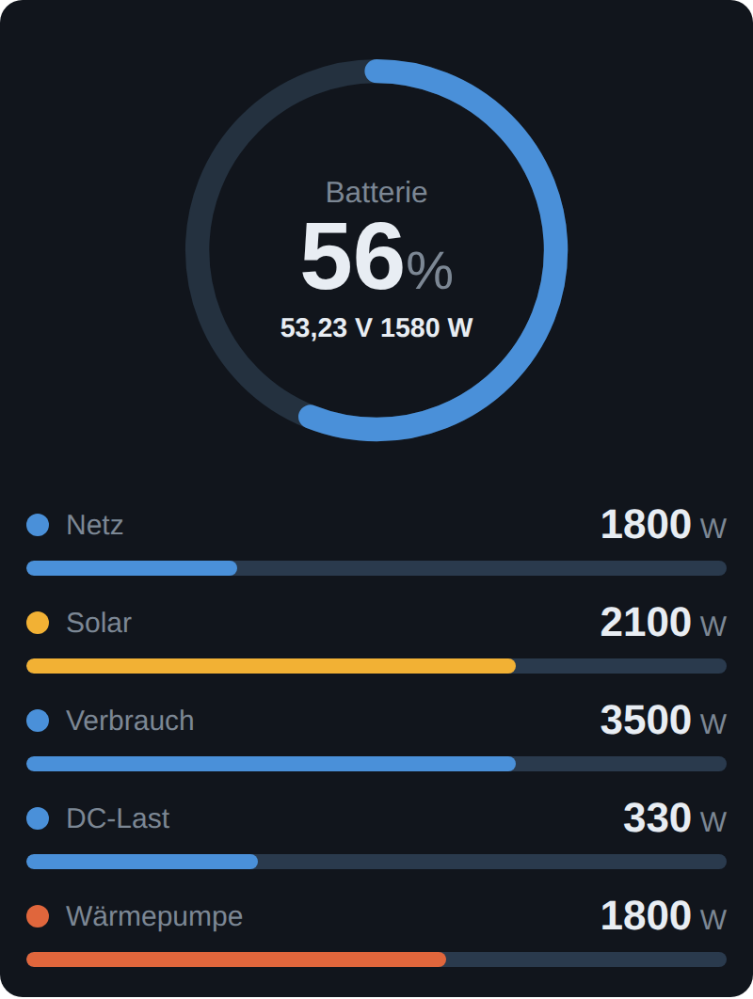

# Victron VRM Energiemonitor für IP-Symcon

Integriert die Live-Werte deiner Victron-Anlage in IP-Symcon – wahlweise aus dem
**VRM-Portal (Cloud-API)** oder per **lokalem MQTT** (Cerbo GX / Venus OS) – und
stellt sie als Variablen sowie als **GUIv2-artige Energiefluss-Kachel** für die
Tile-Visualisierung bereit.

Angezeigt werden:

- ☀️ **Solarleistung** (PV, DC- und AC-gekoppelt)
- 🔋 **Batterie** – Ladezustand (SOC), Spannung und Lade-/Entladeleistung
- 🏭 **Netz** – Bezug und Einspeisung
- 🏠 **Verbrauch** – AC-Lasten und DC-Lasten
- 🔌 **Zweiter Verbraucher** (optional) – z. B. Wärmepumpe aus einer beliebigen Symcon-Variable

Die Kachel ist der Victron-**GUIv2**-Ansicht nachempfunden: Batterie-SOC-Ring in der
Mitte, **0–100 %-Auslastungsbalken** je Quelle/Last und Light- & Dark-Mode.

| Light | Dark |
|-------|------|
|  |  |

Auf schmalen/mobilen Kacheln (Breite < 600 px) schaltet die Kachel automatisch
auf ein **Portrait-Layout** um: Ring oben, darunter gut lesbare Zeilen mit
Auslastungsbalken.

## Voraussetzungen

- IP-Symcon **ab Version 7.1** (HTML-SDK für die Kachel-Visualisierung)
- Eine Victron-Anlage mit GX-Gerät (Cerbo GX, Venus OS o. ä.), verbunden mit dem VRM-Portal
- Ein persönliches **VRM-Zugangstoken**

## Installation

1. In IP-Symcon den **Module Store → Modul über URL hinzufügen** öffnen (oder im
   Module Control) und dieses Repository angeben:
   `https://github.com/teesmokr/symcon-vrm-integration`
2. Anschließend eine neue Instanz vom Typ **„Victron VRM Energiemonitor"** anlegen.

## Datenquelle: VRM Cloud oder MQTT

Im Formular oben wählst du die **Datenquelle**:

- **VRM Cloud** (Standard): einfach, ohne lokalen Netzzugriff, aber die Cloud
  aktualisiert nur alle paar Minuten.
- **MQTT (lokal)**: nahezu Echtzeit über den Broker auf dem Cerbo GX /
  Venus OS. Aktiviere dort **Einstellungen → Dienste → MQTT**. Trage Host/IP
  (Port 1883) ein; Benutzer/Passwort nur falls gesetzt; die Portal-ID wird
  automatisch erkannt. Mit **„MQTT-Verbindung testen"** prüfst du die Anbindung.
  Das Aktualisierungsintervall lässt sich für MQTT bis auf **1 Sekunde** stellen.

## Auslastungsbalken

Die Bögen um den Ring sind **0–100 %-Auslastungsbalken**. Bei Netz, AC-Verbrauch
und Solar wird **je Phase ein eigener Balken** angezeigt (drei konzentrische
Bögen); die große Zahl ist der jeweilige Gesamtwert. Liegen keine Phasendaten vor,
wird ein einzelner Gesamt-Balken gezeigt.

Unter **„Anzeige / Auslastungsbalken"** gibst du je Quelle/Last die Nennleistung (W)
an, die 100 % entspricht (z. B. Solar 5000 W, Netz 11000 W); je Phasenbalken gilt
ein Drittel davon.

## Sichtbarkeit

Unter **„Sichtbarkeit"** lassen sich einzelne Werte aus- und einblenden
(z. B. DC-Lasten ganz ausblenden) sowie einzelne **Solar-Phasen** (L1/L2/L3)
abschalten.

## Zweiter Verbraucher (z. B. Wärmepumpe)

Unter **„Zweiter Verbraucher"** kann eine beliebige Symcon-Variable (Leistung in W)
als zusätzlicher Verbraucher unten in der Kachel eingeblendet werden – mit
eigenem Namen und Auslastungsbalken. Die Kachel folgt Änderungen der Variable live.

## Einrichtung (VRM Cloud)

### 1. VRM-Zugangstoken erstellen

Im [VRM-Portal](https://vrm.victronenergy.com) anmelden und unter
**Einstellungen → Integrationen → Zugangstoken** (Preferences → Integrations →
Access tokens) ein persönliches Token erstellen. Das Token wird nur einmal
angezeigt – kopieren und in der Instanz eintragen.

### 2. Anlage wählen

- Token im Instanz-Konfigurationsformular eintragen.
- Auf **„Anlagen abrufen"** klicken – die Anlagen des Kontos werden geladen.
- Die gewünschte Anlage im Auswahlfeld wählen und **Änderungen übernehmen**.

### 3. Aktualisierungsintervall

Standard sind 60 Sekunden. Die VRM-Cloud speichert die Werte ohnehin nur alle
paar Minuten neu, daher bringt ein sehr kurzes Intervall keine schnelleren Daten.
Für echte Echtzeit-Daten wäre eine lokale Anbindung (MQTT/Modbus TCP zum GX-Gerät)
nötig – dieses Modul nutzt bewusst die Cloud-API ohne lokalen Netzwerkzugriff.

### 4. Kachel in der Visualisierung

Die Instanz stellt automatisch eine HTML-Kachel bereit. In einer
Tile-Visualisierung einfach die Instanz als Kachel hinzufügen – der Energiefluss
wird im Victron-GUIv2-Stil dargestellt und live aktualisiert.

## Wertezuordnung (Auto-Erkennung)

Die Werte werden automatisch aus den VRM-Diagnostics erkannt (u. a. Codes wie
`SOC`, `Pdc`, `o1`…). Da die verfügbaren Codes je nach Anlage, Gerät und Phasenzahl
variieren, gibt es im Abschnitt **„Wertezuordnung (erweitert)"** eine manuelle
Übersteuerung:

- **„Verfügbare Codes auflisten"** zeigt alle von deiner Anlage gelieferten Codes
  mit Beschreibung und aktuellem Wert.
- Bleibt ein Wert `0` oder ist falsch, den/die passenden Code(s) in das jeweilige
  Feld eintragen. Mehrere Codes werden summiert (kommagetrennt), z. B. bei Netz
  oder Verbrauch pro Phase: `o1,o2,o3`.

### Vorzeichen-Konvention

- **Netz**: positiv = Bezug aus dem Netz, negativ = Einspeisung
- **Batterie**: positiv = Laden, negativ = Entladen

## Erzeugte Variablen

| Ident              | Bezeichnung      | Profil        | Einheit |
|--------------------|------------------|---------------|---------|
| `SOC`              | Batterieladung   | `~Battery.100`| %       |
| `BatteryVoltage`   | Batteriespannung | `~Volt`       | V       |
| `BatteryPower`     | Batterieleistung | `~Watt`       | W       |
| `PVPower`          | Solarleistung    | `~Watt`       | W       |
| `GridPower`        | Netzleistung     | `~Watt`       | W       |
| `ConsumptionPower` | AC-Verbrauch     | `~Watt`       | W       |
| `DCPower`          | DC-Lasten        | `~Watt`       | W       |
| `LastUpdate`       | Letzte Aktual.   | `~UnixTimestamp` | –    |

Diese Variablen lassen sich zusätzlich frei in Diagrammen, Skripten und
Ereignissen weiterverwenden.

## Funktionsreferenz

| Funktion                       | Beschreibung                                    |
|--------------------------------|-------------------------------------------------|
| `VRM_Update(int $InstanzID)`   | Ruft die aktuellen Werte sofort aus dem VRM-Portal ab. |
| `VRM_LoadInstallations(int $InstanzID)` | Lädt die Anlagen des Kontos (für das Formular). |
| `VRM_ListCodes(int $InstanzID)`| Listet alle verfügbaren Diagnostics-Codes auf (VRM). |
| `VRM_TestMqtt(int $InstanzID)` | Testet die MQTT-Verbindung und zeigt die empfangenen Werte. |

## Hinweise zum Datenschutz

Das Zugangstoken wird ausschließlich im Header (`X-Authorization: Token …`) an
`https://vrmapi.victronenergy.com` gesendet und lokal in der Instanz gespeichert.
Es werden keine Daten an Dritte übertragen.

## Lizenz

Siehe [LICENSE](LICENSE).
